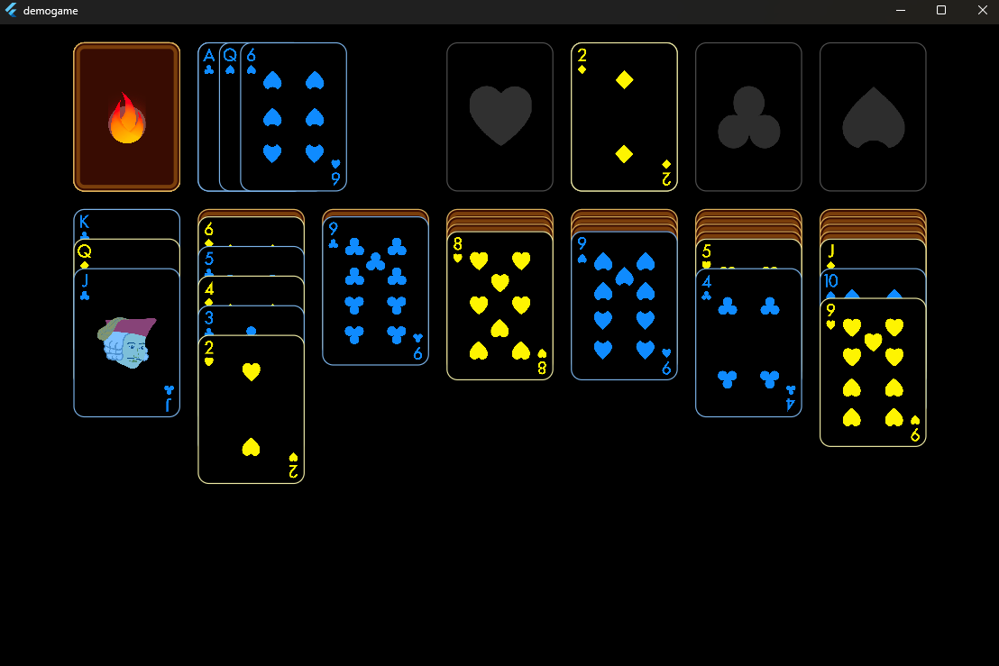

# demogame

Simple tutorial example with Flutter and Flame


## Setup Flutter and Android Studio
Steps for installing flutter and Android Studio in a custom install location on Win64 System.
Once you have flutter and Android configured, you can create your flutter project and add in the Flame Game Engine.

### Install Flutter
1. Install VSCode
2. Install Flutter Extension
	1. Extension will install the SDK
	- Note I end up moving my flutter sdk into a different/common folder
3. Set System Var for flutter SDK bin in PATH
```cmd
# You can echo out in powershell and see flutter bin is in the path
C:\Users\george> $env:Path -split ';' | select-string "flutter"
C:\tools\flutter\bin
```
### Installed Android Studio
Initially I didn't install Android Studio, but I eventually did. I also I adjusted the install location outside of AppData.

1. Downloaded and installed Android Studio into C:\tools\Android\AndroidStudio
2. Install Android SDKs into a custom folder (vs AppData) into C:\tools\Android\SDK
3. Setup System Wide Env vars for Android
```ps1
C:\Users\george> $env:ANDROID_HOME
C:\tools\Android\SDK
```

4. Added in recommend paths for Android Tool Chain
```ps1
C:\Users\george> $env:Path -split ';' | select-string "Android"
C:\tools\Android\SDK\tools
C:\tools\Android\SDK\tools\bin
C:\tools\Android\SDK\platform-tools
```
5. You will also need to install Android Command Line tools, which is NOT installed by default.
	1. Open Up Android Studio
	2. Select More Actions
	3. SDK Manager
	4. SDK Tools
	5. Select/Check "Android SDK Command-line Tools "

### Configure Flutter with Custom Android Location

1. Because you have a custom location, tell flutter where Android SDK is now located:
```ps1
#custom android sdk location, will need to tell flutter
C:\Users\george\work\rnd>flutter config --android-sdk C:\tools\Android\SDK
Setting "android-sdk" value to "C:\tools\Android\SDK".
```

2. Reconfirm Android License Agreement for flutter
```ps1
#you will have to say yes about 5-7 time here
flutter doctor --android-licenses
```

3. Make sure flutter is all configured with android studio

```ps1
[C:\Users\george\work\gdev\flutter-games\otb> flutter doctor
Doctor summary (to see all details, run flutter doctor -v):
[✓] Flutter (Channel stable, 3.32.5, on Microsoft Windows [Version 10.0.26100.4349], locale en-US)
[✓] Windows Version (11 Pro 64-bit, 24H2, 2009)
[!] Android toolchain - develop for Android devices (Android SDK version 36.0.0)
    ✗ cmdline-tools component is missing.
      Try installing or updating Android Studio.
      Alternatively, download the tools from https://developer.android.com/studio#command-line-tools-only and make sure
      to set the ANDROID_HOME environment variable.
      See https://developer.android.com/studio/command-line for more details.
    ✗ Android license status unknown.
      Run `flutter doctor --android-licenses` to accept the SDK licenses.
      See https://flutter.dev/to/windows-android-setup for more details.
[✓] Chrome - develop for the web
[✓] Visual Studio - develop Windows apps (Visual Studio Community 2022 17.11.2)
[✓] Android Studio (version 2025.1.1)
[✓] Connected device (3 available)
[✓] Network resources](<C:\Users\george\work\rnd%3Eflutter doctor -v
[✓] Flutter (Channel stable, 3.32.5, on Microsoft Windows [Version 10.0.26100.4349], locale en-US) [318ms]
    • Flutter version 3.32.5 on channel stable at C:\tools\flutter
    • Upstream repository https://github.com/flutter/flutter.git
    • Framework revision fcf2c11572 (12 days ago), 2025-06-24 11:44:07 -0700
    • Engine revision dd93de6fb1
    • Dart version 3.8.1
    • DevTools version 2.45.1

[✓] Windows Version (11 Pro 64-bit, 24H2, 2009) [4.6s]

[✓] Android toolchain - develop for Android devices (Android SDK version 36.0.0) [1,513ms]
    • Android SDK at C:\tools\Android\SDK
    • Platform android-36, build-tools 36.0.0
    • ANDROID_HOME = C:\tools\Android\SDK
    • Java binary at: C:\tools\Android\AndroidStudio\jbr\bin\java
      This is the JDK bundled with the latest Android Studio installation on this machine.
      To manually set the JDK path, use: `flutter config --jdk-dir="path/to/jdk"`.
    • Java version OpenJDK Runtime Environment (build 21.0.6+-13391695-b895.109)
    • All Android licenses accepted.

[✓] Chrome - develop for the web [76ms]
    • Chrome at C:\Program Files\Google\Chrome\Application\chrome.exe

[✓] Visual Studio - develop Windows apps (Visual Studio Community 2022 17.11.2) [75ms]
    • Visual Studio at C:\Program Files\Microsoft Visual Studio\2022\Community
    • Visual Studio Community 2022 version 17.11.35222.181
    • Windows 10 SDK version 10.0.22621.0

[✓] Android Studio (version 2025.1.1) [13ms]
    • Android Studio at C:\tools\Android\AndroidStudio
    • Flutter plugin can be installed from:
      🔨 https://plugins.jetbrains.com/plugin/9212-flutter
    • Dart plugin can be installed from:
      🔨 https://plugins.jetbrains.com/plugin/6351-dart
    • Java version OpenJDK Runtime Environment (build 21.0.6+-13391695-b895.109)

[✓] Connected device (3 available) [130ms]
    • Windows (desktop) • windows • windows-x64    • Microsoft Windows [Version 10.0.26100.4349]
    • Chrome (web)      • chrome  • web-javascript • Google Chrome 138.0.7204.51
    • Edge (web)        • edge    • web-javascript • Microsoft Edge 138.0.3351.65

[✓] Network resources [264ms]
    • All expected network resources are available.

• No issues found!>)
```


## Flutter Example and Doc

### References - Doc
General Documentation - https://docs.flutter.dev/
Flutter Games (Casual Games Toolkit) - https://flutter.dev/games
Flutter Games Tutorial (Casual Games Toolkit)  - https://docs.flutter.dev/resources/games-toolkit

### Examples - Getting Started
The basic flutter doesn't have collision and game loop mechanics but seem to have some basic stuff. Let's take a look.
There are some basic games you can set up, they have a gitrepo with examples.

Clone out the template projects from:
```ps1
C:\Users\george\work\gdev\flutter-games> git clone https://github.com/flutter/games.git
Cloning into 'games'...
remote: Enumerating objects: 2167, done.
remote: Counting objects: 100% (727/727), done.
remote: Compressing objects: 100% (315/315), done.
remote: Total 2167 (delta 547), reused 430 (delta 410), pack-reused 1440 (from 1)
Receiving objects: 100% (2167/2167), 17.88 MiB | 24.48 MiB/s, done.
Resolving deltas: 100% (1144/1144), done.
```

## Flame Engine
Game engine built on flutter. This add game mechanics into your game such as collision detection, game loop, etc.
### References - Doc
Flame Engine Documentation - [[https://docs.flutter.dev/](<[https://flame-engine.org/](https://flame-engine.org/))>)](https://docs.flame-engine.org/latest/)

### Steps I did
1. Created flutter project (I used VSC Flutter plugin to create the project, you can do this via command line too)
2. Add the flame engine as a dependency to the project - flutter pub add flame
3. Flame expects a certain folder structure, make sure these are created  beforehand (dirs such as ./assets and ./lib/components)
4. Start building out your code, my example code is all with ./lib (this is from the tutorial)
5. Example of game play


